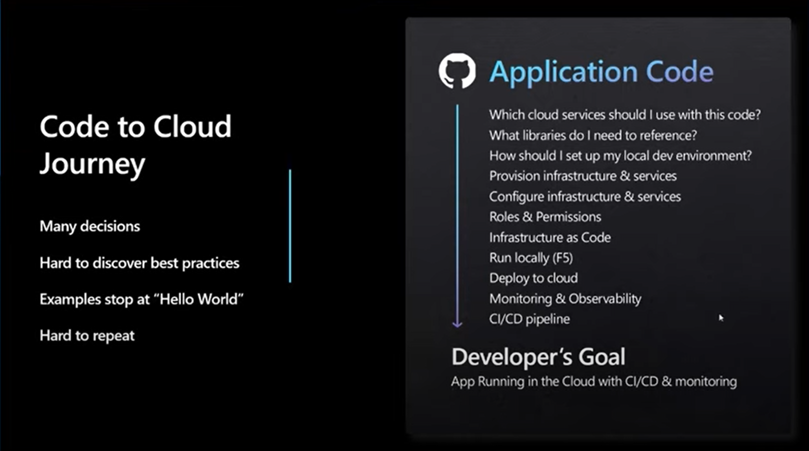

# AZD Introduction

Azure Developer CLI (azd) is an open-source tool that accelerates the time it takes for you to get your application from local development environment to Azure.  
Azd provides best practice, developer-friendly commands that map to key stages in your workflow, whether you’re working in the terminal, your editor or integrated development environment (IDE), or CI/CD (continuous integration/continuous deployment).

Details refer : [Azure Developer CLI Overview](https://learn.microsoft.com/en-us/azure/developer/azure-developer-cli/overview)



## Installation

Below is the installation script you could run in windows, for other installation, please refer [AZD Installation](https://learn.microsoft.com/en-us/azure/developer/azure-developer-cli/install-azd?tabs=winget-windows%2Cbrew-mac%2Cscript-linux&pivots=os-windows)
```poershell
winget install microsoft.azd
```

## Login 
```bash
azd auth login
```

## Templates
```bash
# list official templates
azd template list 

# just init and select a template then
azd init 

# specify a template and init it
azd init --template todo-python-mongo 

# use customized template
azd init --template calvinonazure/app-service-linux-node
azd init --template calvinonazure/app-service-linux-python
azd init --template calvinonazure/app-service-linux-java
azd init --template calvinonazure/app-service-linux-net5
azd init --template calvinonazure/app-service-linux-netcore3.1
azd init --template calvinonazure/app-service-linux-node
azd init --template calvinonazure/app-service-linux-php
azd init --template calvinonazure/app-service-linux-python
azd init --template calvinonazure/app-service-linux-python-django
azd init --template calvinonazure/app-service-linux-python-streamlit
azd init --template calvinonazure/app-service-linux-ruby
azd init --template calvinonazure/app-service-windows-java
azd init --template calvinonazure/app-service-windows-net4.8
azd init --template calvinonazure/app-service-windows-net5
azd init --template calvinonazure/app-service-windows-netcore3.1
azd init --template calvinonazure/app-service-windows-node
azd init --template calvinonazure/app-service-windows-php
azd init --template calvinonazure/function-app-linux-java
azd init --template calvinonazure/function-app-linux-netcore
azd init --template calvinonazure/function-app-linux-nodejs
azd init --template calvinonazure/function-app-linux-python
azd init --template calvinonazure/function-app-linux-python-asp
azd init --template calvinonazure/function-app-linux-python-ep
azd init --template calvinonazure/function-app-linux-python-ep-durablefunction
azd init --template calvinonazure/function-app-windows-custom-php
azd init --template calvinonazure/function-app-windows-netcore
azd init --template calvinonazure/function-app-windows-powershell
```
You could also view the public templates from [https://github.com/topics/azd-templates](https://github.com/topics/azd-templates)

## Deploy
```bash
azd up
azd up --debug # up with debug
```

## Clean Up
```bash
azd down
```